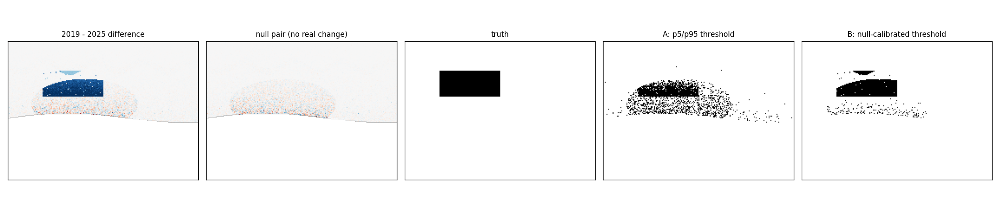

# redsea-change-detection

Shallow-water change detection for the Egyptian Red Sea — and the test that
decides whether to believe the answer.

I built a pipeline to map benthic change along roughly 180 km of coastline
between Marsa Alam and Ras Banas, using Sentinel-2 and a Lyzenga log-ratio to
see through the water column. It flagged **62 km² of change between 2019 and
2025**. Clean map, plausible pattern, concentrated near known development.

Then I ran it on two halves of the same season in the same year — Jan–Feb 2025
against Mar–Apr 2025 — where real benthic change is negligible.

It flagged **183 km²**.

Three times more "change" in two months than in six years. The 62 km² was not a
finding. It was radiometric drift between composites, and the only reason I
know that is the null model.

This repository is that lesson as working code: the method, the null model, and
a demonstration you can run in ten seconds without an Earth Engine account.



## Run it

```bash
git clone https://github.com/GisHussein/redsea-change-detection.git
cd redsea-change-detection
pip install -e ".[dev]"
python run_demo.py --figure docs/demo.png
```

`run_demo.py` builds a synthetic reef whose changed area is **known in advance**
— a 0.21 km² patch of seagrass that becomes sand, in 3–6 m of water, plus the
radiometric drift and sensor noise of a real composite pair. Then it runs the
two thresholds anyone would reach for:

```
attenuation ratio ki/kj : 1.6022
analysis mask           : depth <= 8 m  (19389 px)
true changed area       : 0.210 km2  (10.8% of the analysed area)

null model              : noise floor: sigma=0.0240, p95|d|=0.2431 over 19389 px

threshold A - percentile p5/p95
  real pair :  0.194 km2   10.01%
  null pair :  0.194 km2   10.01%
  recall 0.46   precision 0.50
  -> identical on both pairs. A p5/p95 cut flags 10% of pixels by
     construction, whatever the data contains. It cannot measure extent.

threshold B - calibrated on the null pair at fpr=1%
  threshold : |d| >= 0.516
  real pair :  0.150 km2    7.73%
  null pair :  0.019 km2    1.00%
  recall 0.63   precision 0.89

real / null             : 7.7x
detectable(margin=2.0)  : True
```

Two things fall out of that, and both of them matter more than the map:

**A percentile threshold cannot measure extent.** A p5/p95 cut flags exactly 10%
of valid pixels by construction. Feed it pure noise — 10%. Feed it a scene where
nothing happened — 10%. The area it reports is a restatement of the percentile
you picked, and `tests/test_change_and_nulls.py` asserts this on four different
kinds of input so nobody has to take my word for it.

**The threshold has to come from somewhere outside the image.** Calibrating it on
the null pair at a 1% false-positive rate gives a number with a floor attached:
7.7% against 1%, precision 0.89. That is a claim that survives a question.

It is also honest about what it misses. Recall is 0.63, not 1.0 — the deeper
third of the patch sits below what the method can see at that depth. That gets
reported as a limit, not buried.

## Against real data

```bash
pip install earthengine-api
earthengine authenticate
python earthengine/redsea_gee.py --project your-ee-project
```

`earthengine/redsea_gee.py` builds the Sentinel-2 composites, masks cloud and
land, computes the depth-invariant index, and runs the same null-calibrated
threshold — with the verdict computed by the same `redsea.detectable()` the
tests cover.

Before trusting it on your own site, change two things:

1. **`AOI_COORDS`** — the default is the Marsa Alam → Ras Banas stretch.
2. **The sand polygon** in `main()`. The attenuation ratio is fitted on it, and
   a "sand" polygon that quietly includes seagrass produces a ratio that is
   wrong across the whole scene with nothing downstream to warn you. It is a
   placeholder rectangle in the code, deliberately obvious.

## The method

| Step | Why |
|---|---|
| Median composite, cloud + land masked | one bright cloud edge moves a mean, not a median; a beach that shifted 20 m is a huge log-ratio signal and nothing to do with the seabed |
| Deep-water offset per band | subtract what the sensor sees over optically deep water, where there is no bottom |
| Attenuation ratio from sand at varying depth | `a = (var_i - var_j) / (2·cov_ij)`, `ki/kj = a + √(a²+1)` |
| Depth-invariant index | `ln(G - G_deep) - (ki/kj)·ln(B - B_deep)` — the depth term cancels, what is left is bottom type |
| Shallow-water mask | below the photic limit the difference is amplified noise, and leaving it in is what lets the noise floor swallow the result |
| **Null model** | two epochs where nothing can have changed; whatever it detects is the pipeline talking to itself |
| Null-calibrated threshold | pick the level only 1% of null pixels exceed, apply it to the real pair |
| `detectable()` | is the real extent clear of the null extent, by a stated margin? |

## Modules

| Module | What is in it |
|---|---|
| `redsea/lyzenga.py` | deep-water offset, attenuation ratio, depth-invariant index |
| `redsea/change.py` | differencing and three thresholds, including the percentile one — kept so its behaviour can be asserted |
| `redsea/stats.py` | robust noise floor (MAD-based) and `detectable()` |
| `redsea/normalize.py` | relative radiometric normalisation by trimmed regression, for when the drift survives the deep-water correction |
| `redsea/synth.py` | the synthetic scene, with the seabed seeded separately from the sensor noise so the null pair really is null |
| `earthengine/redsea_gee.py` | the Earth Engine version |

One detail in `synth.py` is worth pointing at, because getting it wrong
invalidates the whole experiment: the seabed is generated from `bottom_seed`,
which is **shared across epochs**, while `seed` only drives sensor noise. An
earlier version varied both per epoch, which quietly injected real change into
the null pair and made the null model look far noisier than it is. The null
model has to be null.

## Tests

```bash
pytest
```

33 tests. The ones that matter:

- `test_attenuation_ratio_recovers_the_known_ratio` — build a sand column with
  known `k_i`, `k_j`, check the estimator returns `k_i/k_j`.
- `test_index_is_flat_over_one_bottom_type_at_varying_depth` — the depth term
  really does cancel.
- `test_percentile_threshold_always_flags_ten_percent` — the trap, asserted.
- `test_null_calibration_recovers_the_patch_and_the_percentile_does_not`.
- `test_no_change_means_no_detection` — the case a change detector must get
  right and rarely gets tested on.

## Limits

Two bands, one band pair. Multi-pair Lyzenga (Green/Blue, Red/Green) is better
over mixed bottoms and is not implemented here. Sunglint correction is not
implemented — on a calm-day composite it matters less than it does per scene,
but it is a real gap. The synthetic scene has a flat-ish depth field; real
reefs have slopes steep enough to break the depth-invariance assumption at the
edges.

## Licence

MIT.
